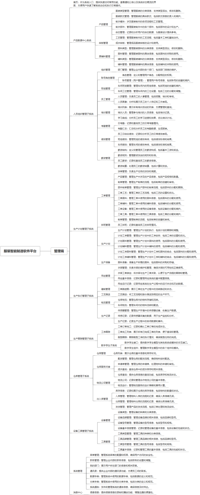

 

    
 

公司拥有上百套具有自主知识产权的软件系统，详情请查看码云首页或公司官网

 
<h1>服装智能制造软件平台</h1>

<a href="https://www.haishi.net.cn/">公司官网</a> ｜ <a href="https://www.haishi.net.cn/">在线体验</a>

 

## 系统介绍

服装智能制造软件平台是一款集成了生产人员管理、订单处理、工艺管理、设备监控、物料管理、仓库服务、大数据展示等多个功能模块的综合管理平台。该平台通过智能化手段，实现从设计、生产、物流到销售的整个服装产业链的数字化管理，旨在提升生产效率，优化资源配置，确保产品质量
服装智能制造软件平台是一款集成了生产人员管理、订单处理、工艺管理、设备监控、物料管理、仓库服务、大数据展示等多个功能模块的综合管理平台。该平台通过智能化手段，实现从设计、生产、物流到销售的整个服装产业链的数字化管理，旨在提升生产效率，优化资源配置，确保产品质量
本项目名称为服装智能制造软件平台，旨在通过数字化手段提升服装制造企业的生产效率和管理水平。该平台涵盖了从产品设计、生产计划、生产执行、生产跟踪到仓库管理、设备管理等服装制造全流程，实现了对人员、物料、设备、工艺等关键要素的全面管理。该平台适用于服装制造企业，包括设计部门、生产部门、仓库部门、管理部门等。
本项目主要包含以下几个终端：
- 服装智能制造平台管理端：公司内部管理员用户使用，可以进行基础数据维护、生产计划制定、生产进度跟踪、数据分析等。
- 生产执行终端：车间工人使用，用于接收生产任务、记录生产数据等。
- 仓库管理终端：仓库管理员使用，用于管理库存、出入库操作等。
- 设备管理终端：设备管理员使用，用于管理设备信息、维护记录等。
                

## 系统功能介绍

### 系统包含终端说明

管理端（WEB）

| 序号 | 模块 | 模块说明 |
| --- | --- | --- |
| 1 | GC-MES-FZZZ-MANAGE | 管理端 |
| 2 | GC-MES-FZZZ-SERVER | 服务端 |

### 系统功能结构

### 系统功能说明

核心功能：
- 产品数据中心系统：提供产品管理、工艺管理、样板管理、原辅料管理等功能，支持对服装产品从设计到生产的全生命周期管理。
- 人员组织管理子系统：提供组织管理、账号角色管理、班组管理、员工管理、培训管理、考勤管理、绩效管理、薪资管理等功能，实现对企业人员的全面管理。
- 生产计划管理子系统：提供工单管理、排班管理、生产计划、生产准备等功能，支持对生产计划的制定和执行。
- 生产执行管理子系统：提供吊挂管理、缝制管理、工艺推送、物流管理、生产记录等功能，实现对生产过程的实时监控和管理。
- 生产跟踪管理子系统：提供工序跟踪功能，实时掌握生产进度。
- 仓库管理子系统：提供仓库列表、出入库管理、仓库服务对接、物流公司管理等功能，实现对仓库的精细化管理。
- 设备工具管理子系统：提供设备管理、工具管理等功能，实现对设备和工具的维护和管理。
其他功能：
- 系统管理：提供菜单管理、职务管理、通讯录等功能，用于系统自身的配置和管理。

## 系统主要界面

## 系统技术说明

### 代码模块说明

| 序号 | 目录 | 目录说明 |
| --- | --- | --- |
| 1 | GC-MES-FZZZ-SERVER/fzzz-boot-module-activiti | -- |
| 2 | GC-MES-FZZZ-SERVER/fzzz-boot-module-erp | -- |
| 3 | GC-MES-FZZZ-SERVER/fzzz-boot-module-system | -- |
| 4 | GC-MES-FZZZ-SERVER/fzzz-boot-module-shop | -- |
| 5 | GC-MES-FZZZ-SERVER/fzzz-boot-module-process | -- |
| 6 | GC-MES-FZZZ-SERVER/fzzz-boot-module-orderbymakeclothplan | -- |
| 7 | GC-MES-FZZZ-SERVER/fzzz-boot-module-personnel | -- |
| 8 | GC-MES-FZZZ-SERVER/fzzz-boot-module-gdnk | -- |
| 9 | GC-MES-FZZZ-SERVER/fzzz-boot-module-mall | -- |
| 10 | GC-MES-FZZZ-SERVER/fzzz-boot-base | -- |

### 系统技术选型

#### 开发语言/框架

JAVA（JDK1.8）
前端框架：VUE2
脚手架：Jeecg

#### 服务中间件

Nginx
Tomcat

#### 数据库

MySQL（5.7+）

#### 其他说明

无

## 系统演示/商用

请扫码添加客服微信获取演示地址和系统详细资料。

如果您想基于服装智能制造软件平台进行商业化交付或定制开发服务，我们提供有偿的技术服务支持，合作模式不限，欢迎沟通！

公司官网地址： <a href="https://www.haishi.net.cn/">https://www.haishi.net.cn</a>

联系客服获取专业回答。

## 使用须知

1、 本项目商用必须获得版权所有者的授权。

2、 未经允许本项目代码不允许二次出售。

